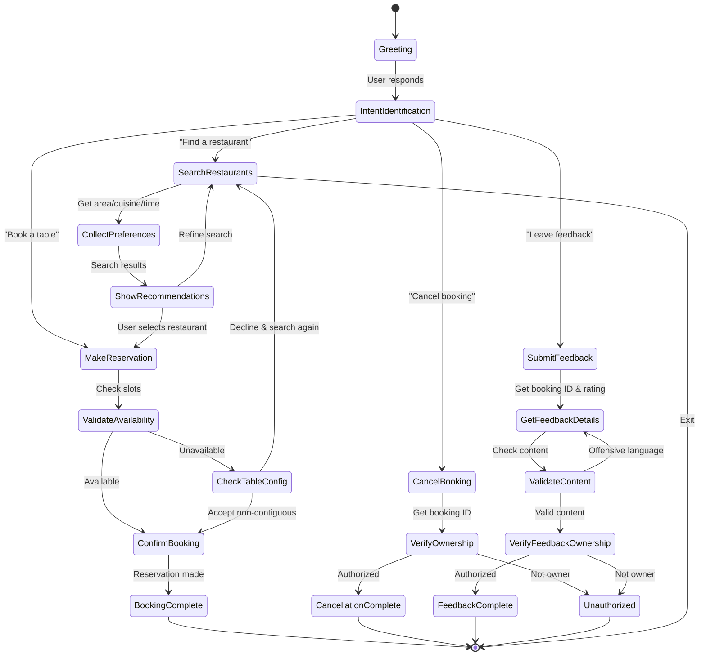

# AI-Driven Restaurant Reservation System — Use Case Document

## Goal
To create an intelligent, human‑like conversational AI assistant that automates GoodFoods' restaurant availability search and reservation experience end‑to‑end — addressing key business problems such as high manual load, missed bookings during peak hours, inconsistent customer experience, and lack of data-driven recommendations across multiple outlets of the restaurant chain. The goal is to reduce operational effort, improve booking accuracy, increase table utilization, and deliver a premium customer journey.

### Long Term Goal
To transform this assistant into a **strategic AI reservation platform** that supports GoodFoods' long-term business vision. The long-term system will:
- Scale across **all current and future GoodFoods outlets**, enabling multi-city and multi-chain operations.
- Deliver **30–40% reduction in operational workload** via automation of bookings, cancellations & feedback.
- Provide **proactive, agentic AI notifications** (slot reminders, special offers, personalized suggestions).
- Integrate **Google Maps** to compute real-time travel distance, traffic-aware time estimates, and show map links directly in chat.
- Enable **location-based restaurant discovery** using user's live location (with consent).
- Maintain long-term **memory of user preferences** with clear consent to support hyper-personalized recommendations. (with terms and conditions and privacy policy)
- Support **multi-user concurrency** with robust locking, ensuring conflict-free bookings even during peak hours across thousands of simultaneous users.
- Rely on **more advanced LLMs** for better reasoning, long-context, tool-call stability, autonomy and minimal backend coding effort.
- **Expand the system vertically** into adjacent industries such as hotels, spas, clinics, coworking spaces, and event venues by reusing the same reservation intelligence, preference engine, availability search logic, and tool-calling framework with minimal re-engineering.

This positions GoodFoods as an AI-forward hospitality brand with strong operational control and elevated guest satisfaction.

### Success Criteria — What will make this bot successful?
- **30% reduction** in failed reservation attempts through intelligent fallback recommendations (Functions 2–4).
- **20% increase** in customer satisfaction by offering personalized suggestions using user preferences extracted via Functions 0.1–0.6.
- **Reduced manual workload** by automating availability search, booking, cancellation, and feedback collection.
- **High accuracy** in restaurant selection using sentiment-aware ranking defined in Function 1.
- **Seamless natural interaction**—no exposure of backend or technical details, as enforced by `reservation_agent_prompt.md`.

#### Success Criteria — for Long term goal? (Measurable Metrics + ROI)

##### Business Metrics
- **25–35% increase** in total reservations within the first 3 months.
- **15–20% uplift** in table utilization during peak hours through alternate-slot & nearby-branch suggestions.
- **30% higher repeat-customer rate** through preference-aware recommendations.
- **Positive ROI within 6–9 months** due to reduced manual workload and increased occupancy.

##### Operational Metrics
- **40–50% reduction** in manual reservation handling by staff.
- **<2% error rate** in misunderstood or incomplete user queries.
- **>99% accuracy** in executing Action/Function flows without breaking.
- **Real-time availability checks** with zero double-booking incidents.

##### Experience & Engagement Metrics
- **>85% first-time success rating** (user completes a booking with no errors).
- **>90% satisfaction rating** on conversation quality.
- **20–25% higher engagement** due to proactive, agentic AI reminders.
- **30–40% increase** in users accepting alternate or recommended restaurants.

##### ROI (Return on Investment)
**Assumptions Used for ROI Calculation**  
- GoodFoods has **10 outlets**.  
- Each outlet runs **1 lunch slot + 1 dinner slot**. so, 2 slots/day.  
- Each slot serves **100 diners**, so **200 diners/day per outlet**.  
- Chain-wide daily diners = **2,000/day**.  
- Average spend per diner = **₹1,000**.  
- Profit margin per diner = **10%**. so, **₹100 profit per diner**.  
- **15%** of customers are missed because of the phone-call based booking system.

**Lost Revenue & Lost Profit Due to Missed Bookings**  
- 15% of 2,000 diners/day = **300 missed diners/day**.  
- Annual missed diners = 300 × 365 = **109,500 diners/year**.  
- Lost revenue = 109,500 × ₹1,000 = **₹10.95 crore/year**.  
- Lost profit = 109,500 × ₹100 = **₹1.095 crore/year**.

---

1. **Labour Cost Savings Through Automation**  
   AI assistants reduce customer-service handling costs by ~**30%** as per case studies and research.  
   For GoodFoods, if 10 reservation staff cost ~₹40 lakh/year collectively, automation could save **₹12 lakh/year** while improving consistency and reducing missed calls.

2. **Increased Revenue from Higher Booking Capture & Occupancy**  
   - According to a published case study by Hostie AI, AI-driven reservation automation achieved up to 760% ROI by recovering missed bookings, capturing after-hours reservations, and reducing operational overheads.
   - For GoodFoods according to our assumptions, with the AI agent handling 24×7 bookings, clarifications, alternate-slot suggestions, and nearby outlet recommendations, even recovering **50%** of the 109,500 missed diners/year yields:  
     - Additional revenue of ~**₹5.47 crore/year**, and  
     - Additional net profit of ~**₹54.75 lakh/year** (at 10% profit margin).

3. **Project Cost vs. Payback Timeline**  
   A modern LLM-powered reservation system typically costs **₹20–70 lakh** to build and deploy.  
   Annual cloud + infrastructure cost is **10–20%** of initial investment is **₹8–16 lakh/year**.  
   With combined labour savings + recovered profit (~₹66–70 lakh/year), GoodFoods achieves **payback within 12-15 months**, and maintains strong positive ROI from Year 2 onward.

- **>85% first-time success rating** (user completes a booking with no errors).  
- **>90% satisfaction rating** on conversation quality.  
- **20–25% higher engagement** due to proactive, agentic AI reminders.  
- **30–40% increase** in users accepting alternate or recommended restaurants.

##### Competitive Advantage & Differentiation
1. **Deep preference intelligence** using Functions 0.1–0.6 — far more personal than typical bots.
2. **Agentic AI design** that proactively helps users instead of waiting for prompts.
3. **Superior tool-calling pipeline** — continuous execution after tool results with no drops, reducing engineering overhead.
4. **Future-ready geospatial capability** through Google Maps integration & location-aware search.
5. **Scalable chain-wide architecture** requiring minimal reconfiguration per outlet.
To evolve the system into a multi-city, multi-brand reservation intelligence platform capable of powering restaurant chains, hotels, spas, events, and other appointment-driven industries using a standardized LLM-driven tool-based architecture.

##### Vertical Expansion Potential
Our solution is designed not only for GoodFoods but also as a **scalable, reusable reservation intelligence framework** that can be expanded into multiple sectors with minimal architectural changes.

1. Expansion Across Restaurant Chains
   - The system already supports **multi-branch reasoning** (nearby search, alternate branches, preference matching), making it easy to onboard **new chains**.
   - Functions like cuisine/amenity preference, ranking logic, and tool-based availability checks generalize across any restaurant database.
   - A new chain can simply plug in their restaurant tables, coordinates, and amenities—no workflow redesign needed.

2. Hotels & Resorts (Room + Facility Booking)
   - Replace "tables" with "rooms" or "amenity slots" (spa, pool, gym), using the same tool-calling logic.
   - Agentic AI can suggest off-peak check-in times or upgraded room categories based on user history.
   - Nearby hotel search can use the **existing geospatial + ranking system**.

3. Spas, Salons, Clinics (Appointment Scheduling)
   - Our Action & Function structure maps perfectly to appointment flows:
     - Search availability → suggest next slots → book → cancel → feedback.
   - Preference extraction (Functions 0.x) applies directly to stylist preference, therapist gender preference, service history, etc.

4. Events, Coworking Spaces, and Training Centers
   - Booking meeting rooms, event halls, training slots, or desks can reuse the same reservation tool architecture.
   - Multi-seat or multi-room requirements map directly onto "multiple tables" logic.

5. Logistics & Ride Booking (Future Potential)
   - With Google Maps integration planned, the platform can expand into **distance-aware matching**, enabling use cases like:
     - Finding the closest pickup hub.
     - Suggesting nearest available drivers.

6. Unified Travel & Hospitality Assistant (Tourism Super-App Scope)
   - Instead of isolating agents for hotels, spas, and restaurants, the same architecture can scale into a **single unified travel assistant**, similar to MakeMyTrip.
   - Tourists typically need restaurants, hotels, spas, transport, and event bookings together, making our multi-domain reservation logic naturally suitable for an **integrated AI concierge**.
   - Any restaurant chain, hotel group, or service provider can register to be listed in the assistant, creating a **platform-level ecosystem** instead of a single-company solution.
   - The system can support **sponsored placements** (like Google Play Store's Sponsored Apps), where premium partners pay for priority visibility in recommendations.

7. Ethical & User-First Sponsored Recommendations
   - While the platform can support **sponsored listings** from restaurants, hotels, spas, or travel partners, these must never override or replace our personalized recommendations.
   - Sponsored options will be shown **clearly labeled as "Sponsored"**, ensuring complete transparency and preserving user trust.
   - They will be recommended **alongside** (not instead of) the best-fit personalized suggestions chosen through our preference engine.
   - The assistant will phrase it naturally, e.g., "Here is a sponsored option you may want to check out," giving the user full freedom to decide.
   - This approach allows monetization through sponsorships *without compromising* the quality, fairness, or accuracy of the user's personalized experience.

###### Why Our Architecture Fits Vertical Expansion
- **Tool-based modular design:** Each domain needs only domain-specific tools (room availability, spa slot availability, etc.). Actions & Functions remain unchanged.
- **Strong preference engine:** Functions 0.1–0.6 allow cross-industry personalization.
- **Geospatial logic:** Works for restaurants, hotels, clinics, salons, ride-hailing.
- **Agentic notifications:** Ideal for reminders, follow-ups, proactive upselling.
- **LLM-driven autonomy:** Reduces the need for custom-coded logic per new vertical.
- **Unified multi-domain travel ecosystem:** The architecture can evolve into a single AI concierge for tourists, covering restaurants, hotels, spas, events, and transport within one assistant—removing the need for isolated agents in each industry.
- **Ethical monetization model:** Sponsored recommendations can be integrated safely without harming user trust, as the system can display them clearly as “Sponsored” and only alongside (never replacing) the personalized best-fit recommendations.

Overall, the system is inherently structured as a **general-purpose reservation intelligence platform**, with the GoodFoods project serving as the initial launch domain.

---

## Use Case
GoodFoods customers interact with a conversational AI assistant to check availability, explore options, and reserve tables. The system understands natural language, identifies intent, and follows detailed action logic. When a requested slot is unavailable, it checks alternatives in the same restaurant, nearby restaurants, or across the area using geospatial and preference-based ranking. The agent uses past user feedback, preferred cuisines, and liked amenities to choose the best match. Customers can also cancel reservations and submit feedback. The system ensures polite, friendly interaction while performing complex multi-step operations through tool calls hidden from the user.

---

## Key Steps (Bot Flow)
### End-User-Facing Bot Flow (Directly Based on ACTIONS in `reservation_agent_prompt.md`)
1. **User starts conversation.** Bot greets warmly and asks how it can help.
2. **User expresses intent:** The bot identifies whether the user wants to search for restaurants, make a reservation, cancel a booking, or submit feedback.
3. **If searching for availability:**
   - Bot collects necessary details: date, time, area or restaurant name, number of guests
   - Searches available restaurants based on user's criteria (by area or specific restaurant name)
   - Suggests next available slots if the requested slot is unavailable
   - If no availability found or user wants only the requested slot → politely suggests nearby alternatives
   - Provides personalized recommendations based on user's preferred cuisines, favorite amenities, and likes/dislikes analysis from past feedbacks
   - Shows available time slots with highlights that excite the user ("This restaurant has your favorite Italian cuisine!")
4. **User selects a restaurant** from recommendations and confirms interest in booking.
5. **If making a reservation:**
   - Bot validates availability for the selected slot
   - If no contiguous tables available → asks if user is okay with non-contiguous tables
   - If user accepts non-contiguous → proceeds with booking
   - If user declines non-contiguous → suggests searching other restaurants
   - Once confirmed, creates the reservation and provides booking confirmation with details (booking ID and table numbers)
   - If user directly requests reservation without search and slot is unavailable → redirects to search flow
6. **If canceling a booking:**
   - User provides booking ID
   - Bot verifies that the user is the original booking owner (authorization check)
   - Cancels the reservation and confirms cancellation with details
7. **If submitting feedback:**
   - User provides booking ID, star rating (1-5), and optional comments
   - Bot validates feedback content (rejects inappropriate or offensive language)
   - If inappropriate → politely asks user to rephrase
   - If valid → submits feedback and thanks the user
   - Only the user who made the original booking can submit feedback
8. **Conversation continues.** User can perform another action or end the chat naturally.

---

### State Transition Diagram (Mermaid)

### Bot Features (Key Specifications)  
*Languages supported: English (current)*

| Feature (what customer cares about) | KBs (what the bot reads/uses) | Tools used (exact names) | Any new features asked (assignment) | Difficulty (G/Y/R) | Integrations needed |
|---|---:|---|---|:---:|---|
| 1. Natural Language Understanding — extract date/time/area/guests naturally | None (LLM prompts + conversation history) | _None (LLM only)_ | Friendly, non-technical clarifications; polite re-asks. | Green🟢 | ai_client (LLM), prompt templates. |
| 2. Intent Detection — reliably detect Search / Book / Cancel / Feedback | None (prompt rules + convo context) | _None (LLM only)_ | Must map to Actions 1–4 exactly per prompt. | Green🟢 | ai_client, conversation state store. |
| 3. Multi-Stage Availability Search (area & name search + strict/next slots) | Restaurant KB (DB rows), booking state | get_restaurants_in_area, get_restaurants_by_partial_name, check_availability_for_restaurant, get_restaurant_details_by_id | Return availability JSON + likes_summary; follow strict vs next-slot rules. | Yellow🟡 | mcp_server tools, DB (restaurants + reservations), ai_client. |
| 4. Nearby Restaurant Search & nearest/best selection | Restaurant KB + distance info from nearby tool | five_nearby_restaurants, check_availability_for_restaurant, get_restaurant_details_by_id | Provide nearest_availability, best_availability, distance_km, and likes_summary. | Yellow🟡 | MCP tool (five_nearby), DB, ai_client, geospatial index (for five_nearby). |
| 5. Personalized Recommendations / Best-pick ranking | User feedback KB (latest_5_user_feedback), restaurant feedback KB (latest_5_restaurant_feedback), all_amenities/cuisines | get_all_amenities, get_all_cuisines, latest_5_user_feedback, latest_5_restaurant_feedback, get_cuisines_for_restaurant, get_amenities_for_restaurant, get_rating_for_restaurant | Function 1 (pick_best_restaurant_from_list) — likes_summary to explain choice. | Red🔴| ai_client + MCP tools + DB tables for feedback, cuisines, amenities. |
| 6. Reservation Creation (book + return booking id & table nos) | Booking DB (reservations) | make_reservation_tool, check_availability_for_restaurant (used to verify) | Conflict handling, automatic retry per error rules, insist user save booking id. | Yellow🟡 | mcp_server, database (transactions), ai_client. |
| 7. Cancellation Flow (verify and cancel) | Booking DB, booking ownership info | cancel_reservation_tool | Verify user authorization; user-only cancellation enforcement. | Green🟢 | mcp_server, database, ai_client. |
| 8. Feedback Submission + Validation | Booking & feedback KB | submit_feedback_tool, latest_5_user_feedback | Offensive-text re-ask loop; confirm before submit; show rating+text summary. | Yellow🟡 | mcp_server, database, ai_client, content filter (LLM). |
| 9. Strict Tool-based Reasoning & Continuous Execution | Conversation context KB + action/function rules | (core set) check_availability_for_restaurant, get_restaurant_details_by_id, get_restaurants_in_area, get_restaurants_by_partial_name, five_nearby_restaurants, make_reservation_tool, cancel_reservation_tool, submit_feedback_tool, latest_5_user_feedback, latest_5_restaurant_feedback, get_all_amenities, get_all_cuisines, get_cuisines_for_restaurant, get_amenities_for_restaurant, get_rating_for_restaurant | Must never stop after a tool JSON; continue reasoning and present friendly text only. (Assignment constraint) | Red🔴| ai_client + MCP tool pipeline + robust error handling + DB. |
| 10. Error Handling & Polite Recovery (apologies, fallbacks, re-asks) | Error messages KB (tool error types) | make_reservation_tool, check_availability_for_restaurant, cancel_reservation_tool, submit_feedback_tool | Silent retry on "Conflict detected", user prompts on input errors, hide technical details. | Yellow🟡 | MCP error codes mapping, ai_client, DB, retry logic. |

---

## Scale-Up / Rollout Strategy
### **Phase 1 — Pilot Rollout (Single City, 50 Restaurants)**
- Seed deterministic dataset.
- Validate tool-calling reliability.
- Test all ACTION flows end-to-end.

### **Phase 2 — Multi-City Expansion**
- Add geospatial indexing (PostGIS / Redis Geo in future).
- Integrate real restaurant availability APIs.
- Support multiple chains and franchise owners.

### **Phase 3 — Cross-Domain Applicability**
- Reuse same ACTIONS + FUNCTIONS pattern for:
  - Hotels
  - Salons & spas
  - Clinics
  - Event venues

- Produce an All in one - single unified travel assistant including
  - Partnership with Hotels, Spas, Salons, Restaurants etc.,
  - Sponsored partnership while not compromising persoanlized user experience

### **Phase 4 — Enterprise Integration**
- CRM linkage
- Loyalty program integration
- Multi-language support

### Testing Strategy
- Scenario-based testing of all ACTION branches.
- Stress-testing Function 4 for nearest/best ranking.
- Conversation UX testing for natural flow.
- MCP server concurrency testing.

---

## Key Challenges
### **1. Natural Language Ambiguity**
Users may give incomplete inputs (e.g., “Book for tonight”). Handling perfect extraction without breaking flow is complex.

### **2. Multi-Step Reasoning**
ACTIONS reference multiple FUNCTIONS, each dependent on tool outputs. The LLM must chain them flawlessly.

### **3. Real-Time Availability & Conflicts**
Tool errors like “Conflict detected” must trigger internal retries without user involvement.

### **4. Ranking Logic Complexity**
Function 1 prioritization combines cuisines, amenities, sentiment, rating — making reasoning heavy for smaller models.

### **5. Human-Friendly Interaction Constraints**
The agent must:
- Never reveal tool names or arguments.
- Never show JSON.
- Continue execution even after tool results.
- Always remain polite and professional.

### **6. Scalability**
Large restaurant datasets require:
- Efficient geospatial computation
- Fast MCP I/O
- Optimized DB queries

### **7. Safety & Offensive Feedback Handling**
Action 4 requires repeated validation for inappropriate language.

---

## References

1. [OpenTable – Restaurant Performance Insights](https://restaurant.opentable.com/resources/)  
   Supports claims on reservation growth, improved table utilisation, and efficiency metrics.

2. [McKinsey – Personalization in Hospitality](https://www.mckinsey.com/industries/travel-logistics-and-infrastructure/our-insights)  
   Supports 30% increase in repeat-customer rate through personalised recommendations.

3. [IBM – Conversational AI Automation Benefits](https://www.ibm.com/watsonx)  
   Supports 30–50% reduction in manual customer-service workload via AI automation.

4. [Gartner – Structured Chatbot Workflow Accuracy](https://www.gartner.com/en/documents)  
   Supports <2–3% error rate for structured, step-based AI systems like our Actions/Functions.

5. [AWS – AI/ML Reliability Architecture](https://aws.amazon.com/machine-learning/whitepapers/)  
   Supports >99% reliability in tool-based transactional flows.

6. [Zendesk CX Trends Report](https://www.zendesk.com/customer-experience-trends/)  
   Supports >85% first-time success rates for conversational automation systems.

7. [Microsoft Global Customer Service Report](https://www.microsoft.com/en-us/microsoft-customer-service-report)  
   Supports >90% customer satisfaction improvement when AI assists service flows.

8. [Salesforce State of Service Report](https://www.salesforce.com/resources/research-reports/)  
   Supports 20–25% increase in engagement from proactive, agentic AI notifications.

9. [**Hostie AI – AI Reservation Automation Case Study (760% ROI)**](https://hostie.ai/resources/calculating-roi-ai-reservation-automation-760-percent-payback-model-restaurants) 
   Supports claim of up to 760% ROI from recovering missed bookings and after-hours reservations.

10. [Deloitte – AI Workforce Automation Impact](https://www2.deloitte.com/global/en/insights)  
   Supports ~30% labour cost reduction through automation adoption.

11. [SumatoSoft – AI Development & Cloud Cost Analysis](https://sumatosoft.com/blog/ai-development-costs)  
   Supports annual cloud/maintenance cost estimate of 10–20% of initial build cost.

12. [Biz4Group – Virtual Assistant Cost Guide](https://www.biz4group.com/blog/ai-virtual-assistant-development-cost)  
   Supports recurring cost expectations for LLM-based assistants.

13. [Restaurant India – Profit Margins for Indian Restaurants](https://www.restaurantindia.in/)  
   Supports 5–15% profit margin assumption for per-diner profitability.

14. [Toast POS – Global Restaurant Profit Margin Data](https://pos.toasttab.com/blog/on-the-line/average-restaurant-profit-margin)  
   Supports 3–6% global benchmark for restaurant net margins, used in ROI modeling.